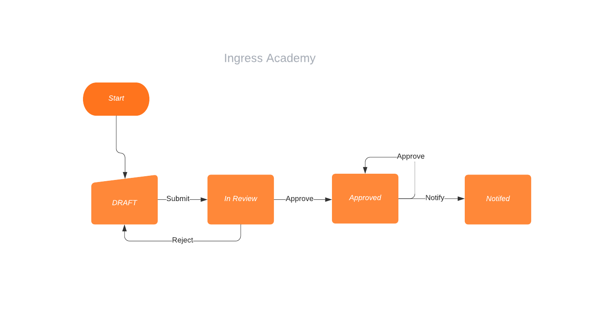

<h1>Custom State Machine With Spring Boot</h1>

<p> 
A state machine is a programming architecture that allows dynamic flow to states depending on values from previous states or user inputs.
This architecture is suitable for applications that can be described as a combination of: States. Decision-making logic that determines when to move to a particular state.
</p>

The below given diagram is a demo account opening process with four formal steps.



It can be illustrated as a simple enum. 
```java
public enum AccountStatus {

    DRAFT(Submit.NAME),
    IN_REVIEW(Approve.NAME, Reject.NAME),
    APPROVED(Approve.NAME, Notify.NAME),
    NOTIFIED();

    private final List<String> transitions;

    AccountStatus(String... transitions) {
        this.transitions = Arrays.asList(transitions);
    }

    public List<String> getTransitions() {
        return transitions;
    }
}
```
In the above code snipped, DRAFT, IN_REVIEW, APPROVED and NOTIFIED are
the states in which the given account can be. Submit, Approve, Reject and Notify are
the possible transitions. DRAFT(Submit.NAME) means we can only make Submit only transition from this state, which will put the account 
in "IN_REVIEW" state. Similarly, from IN_REVIEW state we can make Approve or Reject transitions.

To transition an account from one state to another, we need to invoke
```java
//Draft -> Submitted
        accountTransitionService.transition(account.getId(), Submit.NAME);
```
The transition service will validate if the current transition is allowed or not, and will transition the account to the next state.
If we want to execute custom logic, all we need to put the logic inside
```java
//This should do required pre processing
    void applyProcessing(AccountDto order);
```
method of the Transition interface. That is a nice example of Open Close principle of SOLID.
On each transition, is published as an event and some third party components can subscribe to them and
perform some processing if needed. E.g.

```java
@Slf4j
@Component
public class AccountSubmittedEventHandler implements ApplicationListener<AccountTransitionedEvent> {

    @Override
    public void onApplicationEvent(AccountTransitionedEvent event) {
        log.info("Received account status changed event for account  {}  from state {} to state {} from source{}",
                event.getAccountDto().getId(), event.getAccountStatus(),
                event.getAccountDto().getStatus(), event.getSource());
    }
}
```

To add a new state and transition, all we need to create a new Transition that implements Transition interface, and register the
new state and possible transitions inside the AccountStatus interface.

This is a simple demo with some use cases of SpringBoot features. 